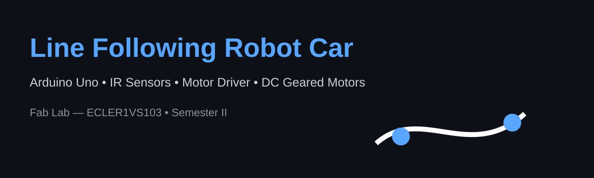

# Line Following Robot Car



An Arduino-based autonomous line-following robot developed for **Fab Lab (ECLER1VS103), Semester II**.

The project is based on the team's Fab Lab presentation and implements a two-IR-sensor feedback system to control two DC geared motors through a motor driver.

## Project idea

The robot detects and follows a visual path, typically a black line on a white surface. IR sensors detect reflected infrared light and the Arduino adjusts the motors to keep the robot aligned with the line.

### Working principle

- White surface reflects IR light strongly.
- Black surface absorbs IR light, producing a weaker sensor response.
- The Arduino reads the two IR sensors and changes the motor speeds/directions accordingly.
- This is a closed-loop feedback system: sensors provide feedback and the controller adjusts the motors.

## Hardware

The presentation specifies:

- Arduino Uno
- 2 × IR sensor modules
- 2 × DC geared (BO) motors with wheels
- L298N or L293D motor driver
- 7.4 V Li-ion battery or 9 V battery
- Acrylic or 3D-printed chassis
- Caster wheel

## Suggested connections

The presentation gives these example Arduino connections:

| Component | Arduino / Driver connection |
|---|---|
| Left IR sensor OUT | D2 |
| Right IR sensor OUT | D3 |
| Motor driver input | D5, D6, D9, D10 |
| Motor driver outputs | Left and right DC motors |
| Ground | Common GND between battery, Arduino and motor driver |

> **Important:** The presentation provides example pin assignments rather than a complete motor-driver wiring table. Verify the exact L298N/L293D board and motor wiring before powering the robot.

## Control logic

The presentation describes this algorithm:

1. Read the IR sensor values.
2. Compare the sensor values.
3. If Left = 0 and Right = 0, move straight.
4. If Left = 1 (on line), slow the left motor and speed up the right motor to turn left.
5. Repeat every few milliseconds.

The presentation also recommends PID control as a future improvement for smoother tracking at higher speeds.

### Implementation note

IR modules differ in whether their digital output is HIGH or LOW when the line is detected. The included Arduino sketch therefore defines the detected-line state as a configurable constant. The exact turn logic should be calibrated against the actual sensor modules and track.

## Repository structure

```text
line-following-robot/
├── README.md
├── LICENSE
├── .gitignore
├── src/
│   └── line_following_robot.ino
└── docs/
    ├── wiring.md
    └── project-notes.md
```

## Uploading the code

1. Install the Arduino IDE.
2. Open `src/line_following_robot.ino`.
3. Select **Arduino Uno** as the board.
4. Select the correct COM/serial port.
5. Upload the sketch.
6. Place the robot on a black line over a light surface.
7. Adjust motor speed and sensor polarity if required.

## Calibration

Start with a low motor speed. Check the serial monitor to see the two sensor states. If the robot reacts opposite to the expected direction, first verify:

- sensor left/right orientation,
- motor polarity,
- motor-driver wiring,
- sensor output polarity,
- `LINE_DETECTED` in the sketch.

## Future scope

The presentation identifies these upgrades:

- Ultrasonic sensors for obstacle avoidance
- Camera/computer vision for more complex paths
- IoT integration for remote monitoring and smartphone speed control
- PID control for smoother high-speed tracking

## Applications

Potential applications mentioned in the presentation include:

- Automated Guided Vehicles (AGVs)
- Hospital logistics
- Manufacturing material transport
- Education and embedded-systems/PID learning

## Source

Project documentation was prepared from the team's Fab Lab presentation: **Line Following Robot Car**.
